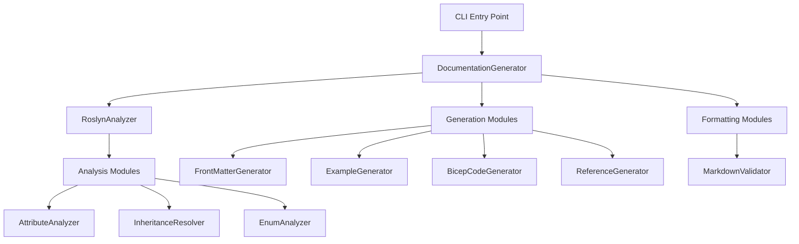

bicep-local-docgen follows a modular architecture with clear separation of concerns.
The recent refactoring has organized the codebase into focused components for better
maintainability and testability.

## High-level architecture



## Core components

### DocumentationGenerator

The main orchestrator that coordinates the documentation generation process:

- **File**: `Services/DocumentationGenerator.cs`
- **Responsibilities**: File I/O, process orchestration, output management
- **Dependencies**: All generation and formatting modules

### RoslynAnalyzer

Handles source code analysis using Microsoft's Roslyn compiler:

- **File**: `Services/RoslynAnalyzer.cs`
- **Responsibilities**: C# syntax tree parsing, file discovery, ignore file processing
- **Dependencies**: Analysis modules for specialized tasks

## Analysis Modules (`Services/Analysis/`)

### AttributeAnalyzer

Extracts Bicep-specific attributes from type and property declarations:

```csharp
// Extract ResourceType attribute
string? resourceType = AttributeAnalyzer.ExtractResourceTypeName(typeDeclaration);

// Extract front matter blocks
List<Dictionary<string, string>> frontMatter = 
    AttributeAnalyzer.ExtractFrontMatterBlocks(typeDeclaration, verbose);
```

**Key methods**:

- `ExtractResourceTypeName()` - Gets ResourceType attribute value
- `ExtractFrontMatterBlocks()` - Processes BicepFrontMatter attributes
- `ExtractHeadingInfo()` - Gets BicepDocHeading information
- `ExtractExamples()` - Processes BicepDocExample attributes
- `ExtractCustomSections()` - Gets BicepDocCustom sections
- `ExtractPropertyInfo()` - Analyzes TypeProperty attributes

### InheritanceResolver

Handles type inheritance and member merging:

```csharp
// Resolve inheritance for all types
InheritanceResolver.ResolveInheritance(types, verbose);

// Extract base types from syntax
List<string> baseTypes = InheritanceResolver.ExtractBaseTypes(typeDeclaration, verbose);
```

**Features**:

- Single-level inheritance resolution
- Member override detection
- Duplicate member prevention

### EnumAnalyzer

Maps enum values to properties that reference those enums:

```csharp
// Map enum values to type members
EnumAnalyzer.MapEnumValues(enumDeclarations, types, verbose);
```

## Generation modules (`Services/Generation/`)

### FrontMatterGenerator

Generates YAML front matter sections:

```csharp
var sb = new StringBuilder();
FrontMatterGenerator.Generate(sb, frontMatterBlocks);

// Get specific front matter value
string? title = FrontMatterGenerator.GetValue(frontMatter, "title");
```

### ExampleGenerator

Creates example usage sections:

```csharp
// Generate custom examples from attributes
ExampleGenerator.GenerateCustomExamples(sb, examples);

// Generate default examples from type members
ExampleGenerator.GenerateDefaultExamples(sb, resourceName, requiredArgs, optionalArgs);
```

### BicepCodeGenerator

Generates Bicep code examples:

```csharp
// Generate resource definition
string bicepCode = BicepCodeGenerator.Generate(resourceName, properties);
```

**Features**:

- Type-appropriate example values
- Proper Bicep syntax formatting
- Support for complex types

### ReferenceGenerator

Creates argument and attribute reference sections:

```csharp
// Generate argument documentation
ReferenceGenerator.GenerateArgumentReference(sb, requiredArgs, optionalArgs, typeLookup);

// Generate attribute documentation
ReferenceGenerator.GenerateAttributeReference(sb, outputs, typeLookup);
```

**Features**:

- Nested type support
- Required/optional indicators
- Enum value formatting

## Formatting Modules (`Services/Formatting/`)

### MarkdownValidator

Validates and processes markdown using Markdig:

```csharp
// Validate markdown and return processed content
string processedMarkdown = MarkdownValidator.ValidateAndProcess(rawMarkdown);
```

**Features**:

- YAML front matter support
- Advanced Markdig extensions
- Validation without reformatting

## Design patterns

### Single responsibility principle

Each class has a focused responsibility:

- Analysis components only analyze code
- Generation components only generate content
- Formatting components only handle markdown processing

### Dependency injection ready

The modular design supports dependency injection for testing:

```csharp
public class DocumentationService
{
    private readonly IAttributeAnalyzer _attributeAnalyzer;
    private readonly IMarkdownValidator _markdownValidator;
    
    // Constructor injection for testability
}
```

### Static methods for simplicity

Most components use static methods for stateless operations, reducing complexity
while maintaining testability.

## Performance considerations

### Lazy loading

Types are analyzed only when needed, reducing memory usage for large codebases.

### Efficient string building

StringBuilder is used throughout for efficient string concatenation.

### Caching

The type lookup dictionary provides O(1) type resolution for inheritance processing.

## Testing strategy

### Unit testing

Each module can be tested independently:

```csharp
[Test]
public void AttributeAnalyzer_ExtractResourceTypeName_ReturnsCorrectValue()
{
    // Test individual components in isolation
}
```

### Integration testing

Full end-to-end testing validates the complete pipeline:

```csharp
[Test]
public void DocumentationGenerator_GenerateAsync_ProducesValidMarkdown()
{
    // Test complete generation process
}
```

## Extensibility

### Adding new attributes

1. Extend `AttributeAnalyzer` with new extraction methods
2. Update models to support new data
3. Add generation logic to appropriate generators

### Adding new output formats

1. Create new formatting modules
2. Implement format-specific generators
3. Update `DocumentationGenerator` orchestration

### Adding new analysis features

1. Create specialized analyzer in `Analysis/` folder
2. Integrate with `RoslynAnalyzer`
3. Update generation pipeline as needed
